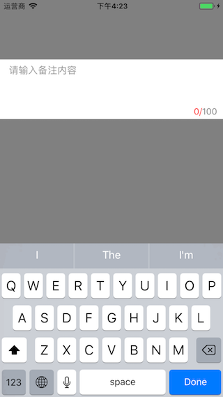

# MRJRemarkTextView

[](https://travis-ci.org/mrjlovetian@gmail.com/MRJRemarkTextView)
[](http://cocoapods.org/pods/MRJRemarkTextView)
[](http://cocoapods.org/pods/MRJRemarkTextView)
[](http://cocoapods.org/pods/MRJRemarkTextView)

## Example

To run the example project, clone the repo, and run `pod install` from the Example directory first.

## Requirements

## Installation

MRJRemarkTextView is available through [CocoaPods](http://cocoapods.org). To install
it, simply add the following line to your Podfile:

```ruby
pod 'MRJRemarkTextView'
```

## use

```
MRJRemarkTextView *remarkTextView = [[MRJRemarkTextView alloc] initWithFrame:CGRectMake(0, 100, [UIScreen mainScreen].bounds.size.width, 100)];
    remarkTextView.limitTextColor = [UIColor purpleColor];
    remarkTextView.limitForegroundColor = [UIColor orangeColor];
    remarkTextView.limitBackColor = [UIColor blueColor];
    remarkTextView.placeholder = @"请输入备注内容";
    remarkTextView.textLimitNum = 100;
    remarkTextView.rowMaxCount = 100;
    [self.view addSubview:remarkTextView];
```

### action

## Author

mrjlovetian@gmail.com, mrjlovetian@gmail.com

## License

MRJRemarkTextView is available under the MIT license. See the LICENSE file for more info.


